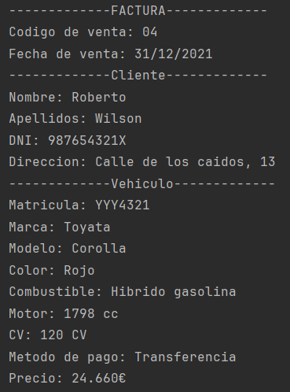

## Description de la tarea

La empresa Automóviles SL nos ha pedido informatizar su negocio para aumentar su
productividad y ser más competitivos. El proceso de trabajo se basa
en el uso de fichas para gestionar la información relacionada con los vehículos y las ventas.

## ¿Cómo se ha implementado?

Se ha implementado mediante un registro de vehiculos y clientes. Esto
se gestiona mediante las ventas

## Keywords

Java class, private, public, String, get, set, void.

## Screenshots or Video

